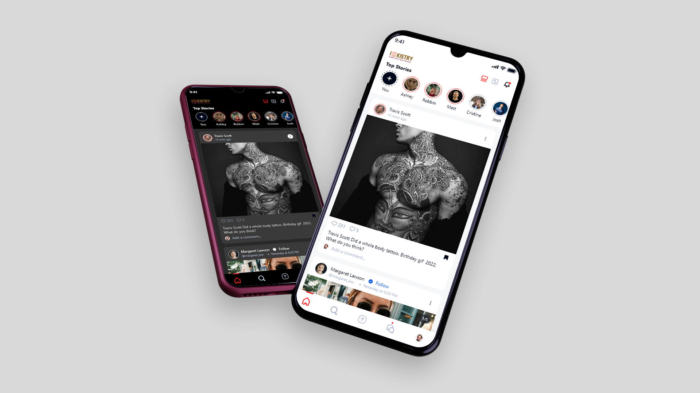
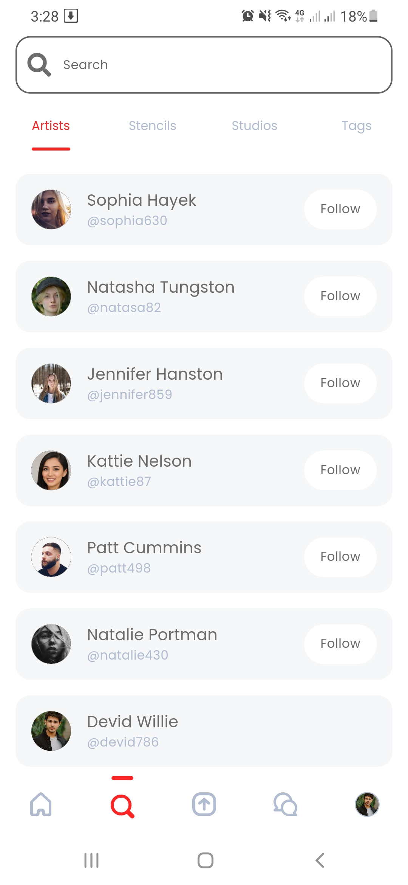

# Inkistry - Tattoo application

An awesome social media and the best mobile app written with Dart & Flutter using Firebase as backend to try any tattoo
by verified artists in canada.


<p align="center">
    
</p>

<p align="center">
    <a href="https://drive.google.com/file/d/1xQFi7Yoex87qH0XMMzpw3anc1rwWg4Jv/view?usp=sharing">
        
    </a>
</p>


## Installation steps

```
git clone https://github.com/Masleap-INC/flutter-mobile-app.git
flutter-mobile-app
flutter packages get
flutter run
```

## Configuration

```
Create Project in Firebase.

* After creating Firebase Project:
- Enable Firestore Database.
- Add Email/Password, Google & Facebook auth provider into the Firebase Authentication.
- Enable Cloud Functions.
- Enable Storage

* Add your app in firebase Project settings and download the google-service.json file and follow the firebase guide.
For android place it in (projectRoot//android/app/google-services.json)


* Our app have Http request on firebase functions so we need serviceAccountKey.json. 
Download it from Google Cloud Console and place it in (projectRoot//firebase/function/serviceAccountKey.json)

* Enable cloud messaging from firebase.
```

## App Features

```
Authentication:
-----
* Signin or Signup with email & passwoord (Android and IOS)
* Sign in with google (Android and IOS)
* Sign in with facebook (Android and IOS)
* Password reset (Android and IOS)
* Apple sign in (Missing)
```

```
Feed:
---
* Two different type of feed layout.
* Stories.
* Posts.
* Like on post.
* Comment on post.
* View all comments on a post.
```

```
Search:
-----
* Search for artists.
* Follow or unfollow an artist or user.
* View artists profile.
* Search for different categories of stencils.
* Search for tags.
```

```
Create post or story:
-----
* Select photos from camera or gallery.
* Custom camera screen.
* Post creating screen.
* Story creating screen.
* Stencils creating screen.
* Tags selecting page.
* Tags user selecting page.
* Can mantion artists or users when creating post.
* Can tag artists or users when creating post.
```

```
Direct message:
-----
* Message other users.
* Group chat.
* Message request.
* Chat tab to pick user.
* Realtime messaging.
* Send text, image and gif.
* Like on message bubble.
```

```
Profile tab:
-----
* View current users profile.
* View artists address, post count, followers count, stencils count.
* View users post and bookmarks.
* Edit user profile. (profile pic, cover pic, name, username, bio and shopname).
* Copy user profile link.
* User Arvived post, deleted post, hidden post etc.
```

```
Artists profile page:
-----
* View artists profile.
* Folow and message user.
* View users post and stencils.
* Copy artists profile link.
```

```
Fcm push notification:
-----
* Push notifications For Comments on posts, Likes on post, New followers.
```

```
Dynamic Links:
-----
* Post link.
* User profile link.
```

```
Firebase Cloud Functions:
-----
* Node Express Api.
* Triggers for Post Upload, Update and Delete.
* Triggers on User follow, unfollow.
* Triggers on new Activity creation.
* Triggers on chat create. (More..)
```

## App Screenshots

|           Welcome            |           Sign In            |           Sign Up            |
|:----------------------------:|:----------------------------:|:----------------------------:|
|  |  |  |

|          Welcome          |           Sign In           |           Sign Up            |
|:-------------------------:|:---------------------------:|:----------------------------:|
|  |  |  |

|           New Post            |           New Story            |           Camera            |
|:-----------------------------:|:------------------------------:|:---------------------------:|
|  |  |  |

|           Latest Chat            |           Create Chat            |           Group Chat            |
|:--------------------------------:|:--------------------------------:|:-------------------------------:|
|  |  |  |

|           Chat Request            |           Direct Messaging            |           Edit Profile            |
|:---------------------------------:|:-------------------------------------:|:---------------------------------:|
|  |  |  |

|           Activity            |           Settings            |            Themes Setting            |
|:-----------------------------:|:-----------------------------:|:------------------------------------:|
|  |  |  |

## Packages are Used

```
#  animator: ^3.1.0
#  cupertino_icons: ^1.0.2
#  get: ^4.6.1
#  get_storage: ^2.0.3
#  font_awesome_flutter: ^9.2.0
#  fluttertoast: ^8.0.9
#  flutter_svg: ^1.0.3
#  dotted_border: ^2.0.0+2
#  cached_network_image: ^3.2.0
#  uuid: ^3.0.6
#  timeago: ^3.2.2
#  intl: ^0.17.0
#  flutter_native_splash: ^2.0.5
#  package_info: ^2.0.2
#  buttons_tabbar: ^1.3.4
#  readmore: ^2.1.0
#  shimmer: ^2.0.0
#  giphy_get: ^3.0.5
#  auto_direction: ^0.0.5
#  firebase_auth: ^3.3.9
#  firebase_core: ^1.13.1
#  cloud_firestore: ^3.1.11
#  firebase_storage: ^10.2.9
#  firebase_messaging: ^11.2.8
#  cloud_functions: ^3.2.14
#  firebase_dynamic_links: ^4.2.2
#  paginate_firestore:
#  git:
#    url: https://github.com/Masleap-INC/staggered_paginate_firestore.git
#    ref: main
#  google_sign_in: ^5.2.4
#  flutter_facebook_auth: ^4.1.1
#  geolocator: ^8.2.0
#  geocode: ^1.0.1
#  path_provider: ^2.0.9
#  image_picker: ^0.8.4+10
#  flutter_image_compress: ^1.1.0
#  camera: ^0.9.4+16
#  image_cropper: ^1.5.0
#  http: ^0.13.4
#  dio: ^4.0.6
#  image_gallery_saver: ^1.7.1
#  share_plus: ^4.0.4
#  connectivity: ^3.0.6
#  flutter_screenutil: ^5.0.0+2
#  flex_color_scheme: ^5.1.0
#  google_fonts: ^3.0.1
#  shared_preferences: ^2.0.6
#  badges: ^2.0.3
#  dio_http_cache: ^0.3.0
#  percent_indicator: ^4.2.0
#  rich_text_controller: ^1.4.0
#  video_thumbnail: ^0.5.0
#  gallery_saver: ^2.3.2
#  pinch_zoom: ^1.0.0
#  flutter_staggered_grid_view: ^0.6.1
#  video_player: ^2.1.4
#  another_xlider: ^1.1.0
#  flutter_phoenix: ^1.0.0
```

## Directory Tree

```
├───lib
│   ├───core
│   │   ├───api
│   │   ├───provider
│   │   ├───services
│   │   ├───values
│   │   └───viewmodel
│   ├───helper
│   ├───model
│   ├───utils
│   └───view
│       ├───auth
│       ├───base
│       ├───camera
│       ├───chat
│       ├───post
│       ├───profile
│       ├───search
│       ├───settings
│       ├───stories
│       └───widgets
│           ├───bottom_sheets
│           ├───camera
│           ├───chat
│           ├───dialogs
│           ├───post
│           ├───profile
│           ├───search
│           ├───shimmer
│           ├───stories
│           └───user
│               └───artist_cards
├───screenshots
```

## What's Next?

- [ ] Active status
- [ ] Custom notification sound.
- [ ] Reply from notification bar.
- [ ] Create studio page.
- [ ] Video compression.
- [ ] Sending multiple image in direct messaging.
- [ ] Sending short video in direct messaging.
- [ ] Create link preview in direct messaging. etc.
